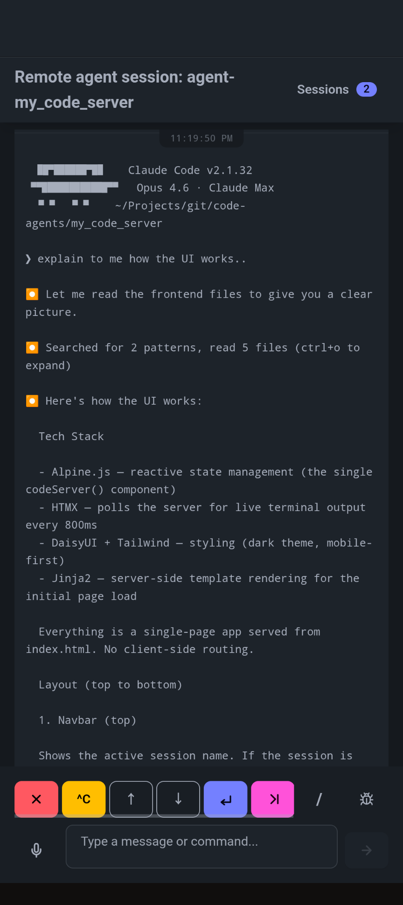

# agentdeck

Your coding agents don't stop working just because you left your desk.
This is a lightweight server that lets you monitor and interact with
AI coding agents (Claude Code, etc.) running on your dev machine —
from your phone, tablet, or that questionable airport WiFi.

Because sometimes you need to approve a file edit while waiting for
your coffee.

## Quick start

```bash
#
# 1. install tmux 
# macOS
brew install tmux
# (Debian/Ubuntu)
sudo apt install -y tmux


# 2. install Claude Code and log in
curl -fsSL https://claude.ai/install.sh | sh
# run claude and login to your account

# 3. install agentdeck and start server
uv sync
uv run uvicorn agentdeck.main:app --host 0.0.0.0 --port 8000
```

Point your browser or your mobile phone to `http://<local_ip>:8000`, tap **New Session**, pick a working
directory, and start talking to your agent.

<!-- screenshot placeholder -->
<!--  -->

## How it works
 

The server wraps each agent in a tmux session, polls the terminal for
output, detects UI states (prompts, selection menus, spinners), and
renders a mobile-friendly interface with tap-friendly controls.

## Features

- **Mobile-first UI** — fat-finger-friendly buttons, works with
  software keyboards, no modifier keys needed
- **Multiple sessions** — run several agents in parallel, switch
  between them
- **Live output** — terminal content streams to your browser via
  HTMX polling
- **Smart controls** — detects numbered selection menus and renders
  them as tappable buttons
- **Readable tables** — box-drawing tables from terminal output are
  converted to HTML tables that reflow on small screens
- **Persistent history** — scrollback is saved to SQLite so you can
  review what happened while you were away

## Security (or lack thereof)

This app has **zero built-in authentication**. By design. It's meant
to run on `localhost` or behind a reverse proxy that handles auth.

The recommended setup is a
[Cloudflare Tunnel](https://developers.cloudflare.com/cloudflare-one/connections/connect-networks/)
with Zero Trust access policies. You get HTTPS, authentication, and
DDoS protection without adding a single line of auth code. Your
server never exposes a port to the internet.

```
  Your Phone                 Cloudflare Tunnel            Your Server
 ┌──────────┐              ┌─────────────────┐          ┌──────────-────┐
 │ Browser  │── HTTPS ────►│  Zero Trust     │── HTTP ─►│ agentdeck     │
 │          │              │  (auth + tunnel)│          │   :8000       │
 └──────────┘              └─────────────────┘          │               │
                                                        │   ┌────────┐  │
                                                        │   │ tmux   │  │
                                                        │   │sessions│  │
                                                        │   │        │  │
                                                        │   │ agent-1│  │
                                                        │   │ agent-2│  │
                                                        │   └────────┘  │
                                                        └───-───────────┘
```

## Tech stack

FastAPI, HTMX, Alpine.js, DaisyUI, tmux, SQLite. No Node.js build
step. Just Python and tmux.

## Development

```bash
uv sync                    # install dependencies
uv run pytest -v           # run tests
uv run ruff check . --fix  # lint
uv run ty check            # type check
```

## Contributing

Contributions are welcome! 

- [`CLAUDE.md`](CLAUDE.md) — coding conventions and quality gates
- [`docs/architecture.md`](docs/architecture.md) — system design,
  component overview, and data flow

Licensed under Apache 2.0.
