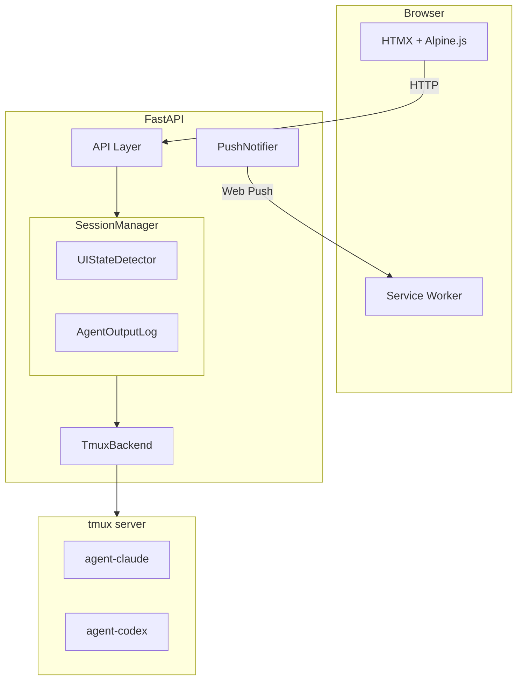
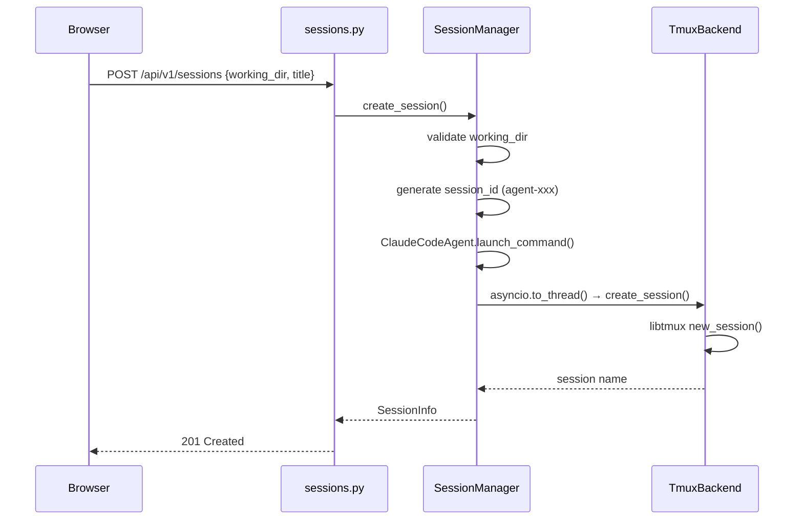
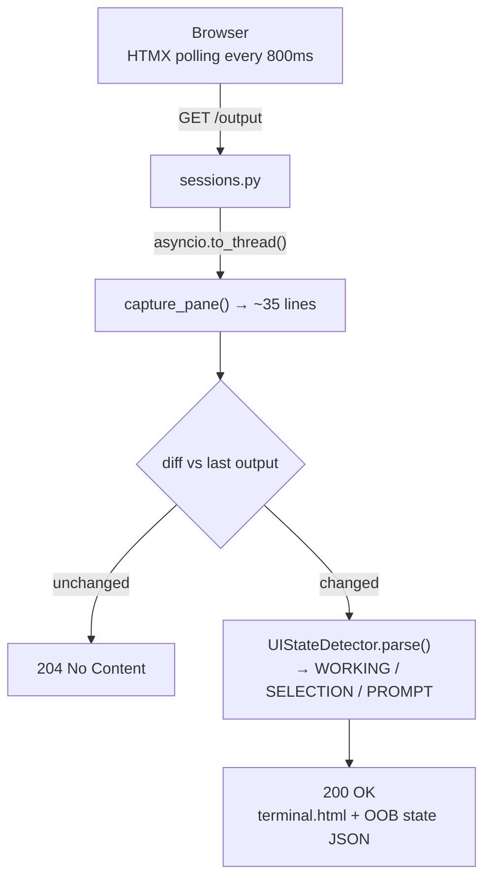
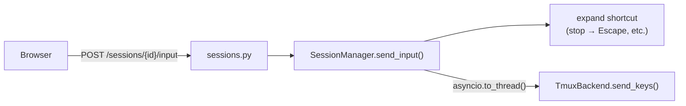
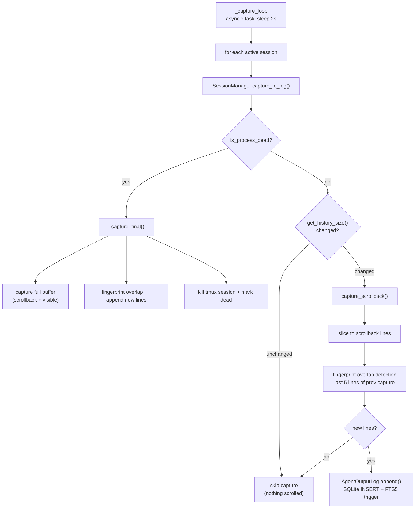
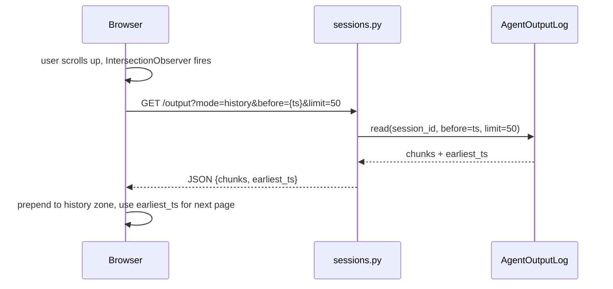
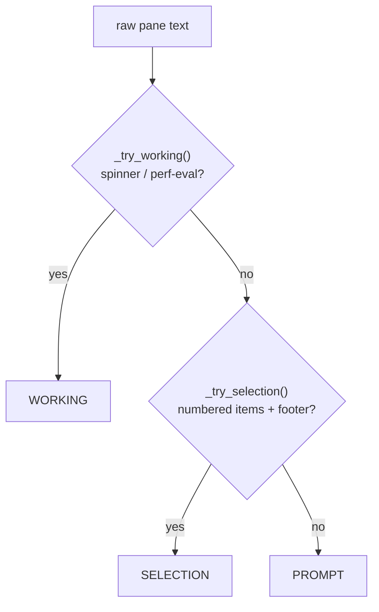

# Architecture

Remote browser access to coding agents running on a local machine.
FastAPI backend manages tmux sessions, serves output via HTMX polling,
and detects agent UI states (spinners, selection menus, prompts)
so the browser can render appropriate controls.

## Components



### How components connect

- **Browser → API Layer** — REST calls for session CRUD, HTMX polling
  for real-time output. Alpine.js holds UI state.
- **API Layer → SessionManager** — every endpoint delegates to the
  manager. `app.state.session_manager` is set during lifespan.
- **SessionManager → TmuxBackend** — all tmux calls go through
  `asyncio.to_thread()` because libtmux is synchronous.
- **SessionManager → UIStateDetector** — raw pane text is fed to the
  parser after each capture. The parsed `UIState` rides back to the
  browser as an OOB div alongside the terminal HTML.
- **SessionManager → Agent Adapter** — used at session creation
  (build launch command) and on every input (expand shortcuts to
  tmux key sequences).
- **TmuxBackend → tmux** — `libtmux.Server` talks to the local tmux
  server process. Each session is an independent window that survives
  server restarts.
- **PushNotifier → Service Worker** — the capture loop feeds parsed
  UI state to the notifier, which sends Web Push messages via
  `pywebpush`. The service worker displays them as OS notifications.

## Layers

### 1. Configuration — `config.py`

Pydantic `BaseSettings`, loaded from env vars or `.env`.

| Setting | Default | Purpose |
|---|---|---|
| `tmux_pane_width` / `height` | 100 / 35 | Terminal dimensions |
| `tmux_scrollback_lines` | 2000 | tmux history-limit per session |
| `poll_interval_ms` | 800 | HTMX output poll rate |
| `capture_interval_s` | 2 | Background capture loop interval |
| `session_refresh_ms` | 3000 | Frontend session-list poll interval |
| `default_working_dir` | `$HOME` | Fallback for new sessions |
| `state_dir` | `state` | Persistent storage (DB, recent dirs) |
| `public_url` | `https://code.vino9.net` | Public URL for push notification links |

### 2. Tmux backend — `sessions/tmux_backend.py`

Synchronous wrapper around `libtmux.Server`. Every method blocks,
so callers use `asyncio.to_thread()`.

| Method | What it does |
|---|---|
| `create_session(name, cmd)` | Spawn tmux session with configured pane size. Sets `remain-on-exit on` so the pane survives process death. |
| `send_keys(name, keys)` | Type text or send control keys (Escape, C-c, Up, …) |
| `capture_pane(name)` | Read visible pane content |
| `capture_scrollback(name)` | Scrollback lines above the visible pane |
| `get_history_size(name)` | Current scrollback line count above visible pane |
| `is_process_dead(name)` | Whether the pane's process has exited (`pane_dead_status`) |
| `kill_session(name)` | Terminate session |
| `is_alive(name)` | Check existence |
| `list_sessions()` | Return all session names |
| `get_session_path(name)` | Current working dir from pane |

### 3. Session manager — `sessions/manager.py`

Async orchestrator. Wraps every `TmuxBackend` call in
`asyncio.to_thread()` so the event loop stays responsive.

Responsibilities:

- **Lifecycle** — create / kill / list / get sessions.
- **Input** — expand shortcuts through the agent adapter, then forward
  to tmux. `send_selection()` navigates numbered menus by sending
  Up/Down/Enter keys.
- **Output** — diff against last capture; skip unchanged frames.
  Delegates parsing to `UIStateDetector`.
- **Background capture** — `capture_to_log()` captures scrollback
  only (excludes visible pane), skips when nothing has scrolled,
  and does a final full capture on process death. Runs every ~2s
  for all active sessions via an asyncio task.
- **Recent dirs** — track the last 10 working directories in
  `state/recent_dirs.txt`.
- **Session IDs** — `agent-{slug}` (max 20 chars), auto-suffixed on
  collision (`-2`, `-3`, …). The `agent-` prefix lets the server
  recover sessions after a restart.

### 4. UI state detector — `sessions/ui_state_detector.py`

Stateless regex engine that classifies raw pane text into one of three
UI states:

| State | Detection rule |
|---|---|
| **WORKING** | Spinner line (non-ASCII char + text + `…`) in the bottom 10 lines, or a performance-eval prompt (auto-responds `2`) |
| **SELECTION** | ≥ 2 numbered items plus the navigation footer (`Enter to select · ↑/↓ …`) |
| **PROMPT** | Fallback — no spinner, no valid selection |

Selection parsing extracts item numbers, labels, descriptions, the
currently highlighted index (❯ / › marker), and whether any item is
a freeform "type something" option.

### 5. Output log — `sessions/agent_output_log.py`

SQLite-backed append-only log with FTS5 full-text search. Stores
terminal output captured by the background loop for history browsing
and search across sessions.

| Method | What it does |
|---|---|
| `append(session_id, lines)` | Insert a chunk of new lines |
| `read(session_id, before, limit)` | Paginate chunks by timestamp |
| `search(query, session_id)` | FTS5 full-text search with snippets |
| `latest_ts(session_id)` | Most recent chunk timestamp |
| `session_ids()` | All sessions with log data |

Schema: `chunks` table (id, session_id, ts, content) indexed by
`(session_id, ts)`, plus a `chunks_fts` FTS5 virtual table synced
via triggers. WAL mode for concurrent reads during writes.

Database file: `state/output.db`.

### 6. Agent adapters — `agents/`

`BaseAgent` is an ABC with two methods:

| Method | Returns |
|---|---|
| `launch_command(working_dir)` | Shell command string |
| `expand_shortcut(text)` | `(keys, enter)` tuple or `None` |

`ClaudeCodeAgent` implements it for `claude`:

- Launch: `scripts/start_agent.sh {dir} claude` (activates `.venv`
  if present, then execs the agent)
- Shortcuts: stop → Escape, yes → y, no → n, cancel → C-c,
  up/down/enter → arrow keys

The ABC exists so other agent types (e.g. Codex) can be plugged in.

### 7. REST API — `api/sessions.py`

| Method | Path | Purpose |
|---|---|---|
| POST | `/api/v1/sessions` | Create session (201) |
| GET | `/api/v1/sessions` | List sessions |
| GET | `/api/v1/sessions/recent-dirs` | Recent directories |
| GET | `/api/v1/sessions/{id}` | Session details (404 if missing) |
| POST | `/api/v1/sessions/{id}/input` | Send text or shortcut |
| POST | `/api/v1/sessions/{id}/select` | Select a menu item |
| DELETE | `/api/v1/sessions/{id}` | Kill alive session or remove dead one |

### 8. Output polling — `api/sessions.py` (`GET .../output`)

`GET /api/v1/sessions/{id}/output` — HTMX polls this every 800 ms.

- **200 OK** with HTML when content changed (or `force=true`) —
  renders `terminal.html` partial + an OOB div with parsed state JSON.
- **204 No Content** when unchanged — HTMX skips the swap, no DOM
  thrashing or bandwidth wasted on idle sessions.

The OOB div (`#ui-state-data`) carries `ParsedOutput` JSON so the
browser can show/hide selection overlays without re-parsing HTML.

### 9. Frontend

**Stack:** DaisyUI 4 (Tailwind), HTMX 2 (polling),
Alpine.js 3 (reactive state), all loaded from CDN.

The Alpine component (`codeServer()` in `app.js`) manages:

- Session list, active session, connection state (tracked via
  `htmx:afterRequest`).
- Session list polling — `refreshSessions()` runs every
  `session_refresh_ms` (default 3s) to detect dead sessions
  regardless of which session is active.
- UI state sync — a `MutationObserver` on `#ui-state-data` parses the
  JSON attribute and updates Alpine state for selection overlays.
- Auto-scroll — a `MutationObserver` on `#terminal-output`.
- Sticky scroll timestamp — a non-interactive badge at the top of
  the scroll area shows the timestamp of the topmost visible history
  chunk while scrolling. Auto-hides after 1.5s. Format:
  `h:mm:ss AM/PM` (<12h) or `Mon D h:mm AM/PM` (older).
- Button layout system — a `buttonLayout` computed getter drives
  which shortcut buttons appear in the bottom bar. Three layouts:
  - **normal** — ESC, ↑, ↓, Enter, Tab, Ctrl-C (agent interaction)
  - **scroll** — ESC, ↑, ↓, ←Prev, →Next, ↓Bottom (prompt
    navigation). Activates after scrolling ~2 viewports up.
  - **selection** — replaces the entire input bar with numbered
    option buttons when the agent presents a selection menu.
  Priority: scroll > selection > normal. Shared buttons (ESC, ↑, ↓,
  /, Debug, Image) are always visible across layouts.
- Recent-directory autocomplete on session creation.

## Data flow

### 1. Creating a session



### 2. Live output (how the UI stays up to date)

HTMX polls `GET /output` every 800ms. The server captures the
visible tmux pane, diffs against the last capture, and returns
HTML only when content has changed.



User input flows the other direction:



### 3. Background output capture (persistent history)

An asyncio task runs independently of any browser connection,
capturing scrollback for ALL active sessions every ~2s into
SQLite. This ensures output is preserved even when no browser
is connected.

The capture loop only stores **scrollback** — lines that have
scrolled above the visible pane. The visible pane (spinners,
progress bars, in-place updates) is excluded from history. This
cleanly separates stable history from volatile live content.



**Fast path** (common case — spinners/tool panels updating
in-place): one `get_history_size` call + integer comparison.
Skips the entire capture. This is the typical state during
Claude's thinking and tool execution.

**Scroll path**: fingerprint logic runs only on stable
scrollback content, so matches are reliable.

**Death path**: `remain-on-exit on` keeps the tmux pane alive
after the process exits. The capture loop detects death via
`is_process_dead()`, does one final full capture (scrollback +
visible pane), then kills the tmux session and marks it dead.

### 4. History scrollback

The terminal view has two zones:

| Browser Window |  |
|---|---|
| **↑ history zone** <br/> stable, frozen output <br/> scrollback from SQLite, loaded on scroll-up | top |
| **live zone** <br/> visible pane via HTMX polling <br/> volatile, real-time | bottom |

These two zones correspond to different data sources:

- **History zone** = scrollback lines captured by the background
  loop. Only content that has scrolled above the visible pane.
  Stable — never changes once captured.
- **Live zone** = the visible tmux pane (~35 lines). Volatile —
  spinners, progress bars, and tool panels update in-place here.

When the user scrolls up past the live pane, the browser fetches
older output from the SQLite database via timestamp-based
pagination.



### 5. UI state detection



## Session lifecycle

Sessions have two states: **alive** (tmux process running) and
**dead** (process ended, history preserved).

### Alive sessions

Tmux windows that survive server restarts. On startup the manager
scans for existing `agent-*` sessions and rehydrates its internal
registry. On shutdown it leaves sessions running so long-lived
agent work is never lost.

### Death detection

A session becomes dead when:

- **Explicit kill** — user clicks the X button, which force-kills
  the tmux session immediately. Users can send Ctrl-C or `/exit`
  via the input area for a gentler shutdown before killing.
- **Process exit** — the agent process ends naturally. The capture
  loop detects this via `is_process_dead()`, does a final full
  capture, kills the tmux session, and marks it dead.
- **Auto-detection** — `list_sessions()` and `get_session()` poll
  `tmux.is_alive()` for alive sessions. If tmux reports the session
  gone, the manager marks it dead automatically.

Dead sessions keep `is_alive=False` and `ended_at` (Unix timestamp)
in the in-memory registry. Input and selection calls raise
`ValueError` for dead sessions.

The frontend polls `GET /api/v1/sessions` every 3s to sync the
session list, so the UI reflects death within a few seconds
regardless of which session the user is viewing.

### Dead session rehydration

On server startup, after rehydrating live tmux sessions, the
lifespan queries `AgentOutputLog.session_ids()` for any session ID
with log data that isn't already known. These are registered as
dead sessions so their history remains browsable.

### Deletion and soft delete

Deleting a dead session calls `AgentOutputLog.soft_delete()`, which
sets `archived=1` on all chunks for that session. Archived chunks
are excluded from `read()`, `search()`, and `session_ids()` queries
but remain in the database for future purge logic.

The DELETE endpoint handles both states: alive sessions get
force-killed immediately, dead sessions get removed.

### UI

The session dropdown splits into two sections:

- **Active** (top) — green dot, click to switch, kill button.
- **History** (below divider) — grey dot, relative time, click to
  view history, remove button.

Dead sessions show a history-only view with no live zone, no input
bar, and a "Session ended" banner.

## Multi-user access

This application has **no session exclusivity**. There is no
in-app authentication — access control is deferred to external
providers (e.g. Cloudflare Zero Trust).

If multiple users (or browser tabs) access the same agent session
simultaneously:

- **Output**: all viewers see the same tmux pane content. Each
  browser polls independently; they all get the same terminal
  state.
- **Input**: all viewers can send input. Keystrokes interleave
  in the order they arrive at the tmux pane. There is no locking
  or turn-taking — this is equivalent to two people typing into
  the same terminal.
- **State detection**: each viewer gets the same `UIState` since
  it's derived from the same pane content.

This is by design for the single-user, single-machine use case.
For multi-user deployments, restrict access at the network layer
or add session-level locking in a future version.

## Push notifications

Web Push notifications alert the user when an agent session
needs input — so they don't have to keep the browser open.
Notifications fire when a session transitions into PROMPT or
SELECTION state and are suppressed if the app is focused.

### Components

```
notifications/
├── vapid.py    # VAPID key generation + loading
├── store.py    # JSON-file subscription store
└── push.py     # State-gated push delivery
api/
└── notifications.py  # REST endpoints
static/
└── sw.js       # Service worker
```

### VAPID keys — `notifications/vapid.py`

On first run, generates an EC P-256 key pair using `py_vapid`
and persists it to `state/vapid_private.pem` +
`state/vapid_keys.json`. Subsequent starts load from disk.
The public key is served to browsers for `pushManager.subscribe()`.

### Subscription store — `notifications/store.py`

`PushSubscriptionStore` — a JSON-file-backed store at
`state/push_subscriptions.json`. Each entry is an
`(endpoint, p256dh, auth, session_id)` tuple. The browser
subscribes per-session, so one device can watch multiple
sessions.

Operations: `subscribe` (upsert), `unsubscribe` (single
session), `remove_endpoint` (all sessions for a dead endpoint),
`get_subscriptions_for_session`, `get_session_ids_for_endpoint`.

Designed for single-user usage with a handful of subscriptions.
No locking — all access runs on the async event loop.

### Push delivery — `notifications/push.py`

`PushNotifier` tracks the last known `UIState` per session.
It only sends a push when the state transitions *into*
`PROMPT` or `SELECTION` from a different state. Same-state
repeats are suppressed.

On delivery failure, 404/410 responses trigger automatic
endpoint removal from the store (browser unsubscribed or
subscription expired).

### Notification API — `api/notifications.py`

| Method | Path | Purpose |
|---|---|---|
| GET | `/api/v1/notifications/vapid-key` | VAPID application server key |
| POST | `/api/v1/notifications/subscribe` | Register push for a session |
| POST | `/api/v1/notifications/unsubscribe` | Remove push for a session |
| GET | `/api/v1/notifications/subscriptions` | Session IDs for an endpoint |

### Service worker — `static/sw.js`

Registered at root scope (`/sw.js` served via a dedicated
route with `Service-Worker-Allowed: /`).

- **Push handler** — suppresses notification if any app window
  is focused. Otherwise shows a notification with the app icon,
  tagged by session ID (so newer notifications replace older
  ones for the same session via `renotify: true`).
- **Click handler** — focuses an existing app window and
  navigates to the session URL, or opens a new window if none
  exists.

### Integration with capture loop

The background capture loop (`_capture_loop` in `main.py`)
drives push notifications alongside output capture:

1. For each active session, capture scrollback to the log.
2. Capture the visible pane, parse it with `UIStateDetector`.
3. Fire `PushNotifier.check_and_notify()` in a background task.

Push delivery runs in `asyncio.to_thread()` since `pywebpush`
is synchronous. Errors are logged but never block the capture
loop.

### Frontend integration

The Alpine.js component tracks per-session notification state
in `_notifiedSessions` (a `Set` of session IDs). On init, it
queries the server for existing subscriptions. The "Enable/
Disable notifications" toggle appears in the attach menu and
calls `toggleNotification()`, which handles permission request,
push subscription creation, and server-side subscribe/
unsubscribe.

Notifications are only available when the app is served from
the configured `public_url` (required for service worker scope
matching).

## Design decisions

- **Sync backend, async manager.** libtmux is blocking; wrapping each
  call in `to_thread()` keeps the event loop free without reimplementing
  tmux IPC.
- **Server-side state detection.** Parsing happens on the server so the
  browser gets structured data, not raw terminal text it would need to
  regex itself.
- **Output diffing.** Unchanged frames return 204 No Content so HTMX
  skips the DOM swap, saving bandwidth for idle sessions.
- **OOB swaps for state.** HTMX out-of-band updates let the server
  deliver both terminal HTML and structured state in a single response.
- **Agent ABC.** `BaseAgent` makes it straightforward to add other
  agent types without touching session or API code.
- **Two-tier output storage.** The live pane (tmux, ~35 lines) serves
  real-time polling. The SQLite log (AgentOutputLog) provides
  persistent history and full-text search. The background capture
  loop bridges the two, running independently of browser connections.
- **Scrollback-only capture.** History only stores lines that have
  scrolled above the visible pane. This avoids duplicating volatile
  content (spinners, progress bars) that changes in-place. The
  `history_size` fast-path skips capture entirely when nothing has
  scrolled — the common case during agent thinking.
- **Force-kill only.** No graceful shutdown logic. Users can send
  Ctrl-C or `/exit` via the input area before killing. The X button
  is a force-kill for immediate cleanup.

## Known issues

- **Screen-boundary duplication in history.** The last few lines of
  a scrollback capture can overlap with the first few lines of the
  next visible-pane content that later scrolls up. The fingerprint
  dedup handles most cases, but near-duplicate lines can occasionally
  appear at capture boundaries. See `docs/screen-dup.md` for
  analysis. Not a significant problem in practice — the overlap is
  small and the content is still correct. Low priority.
